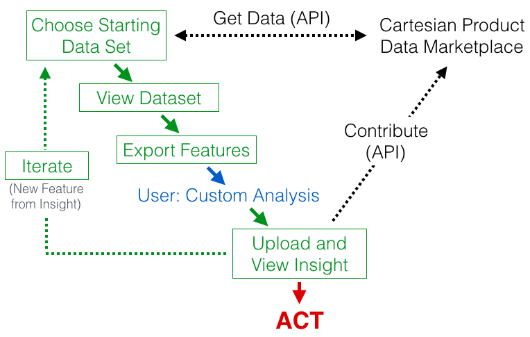
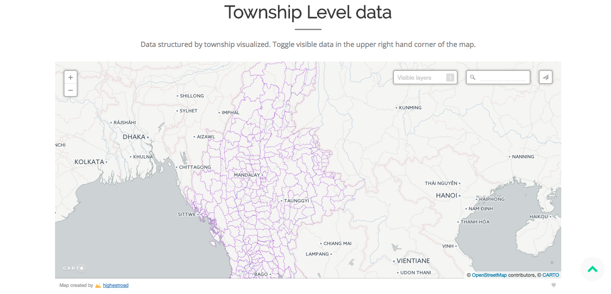
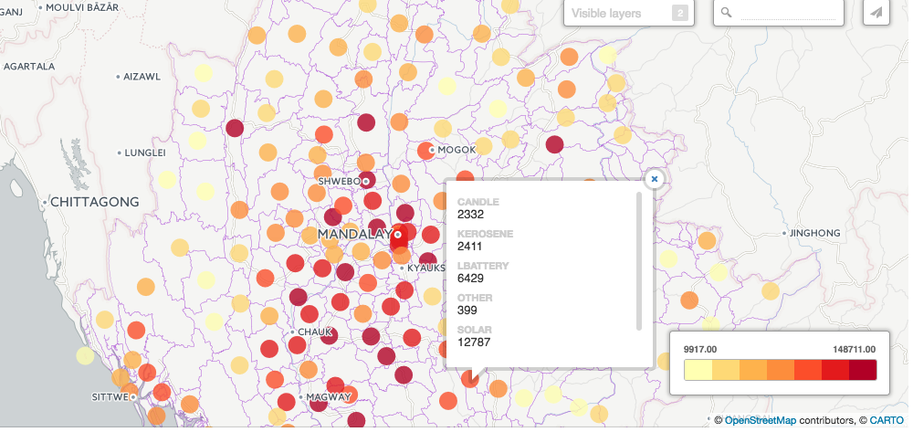
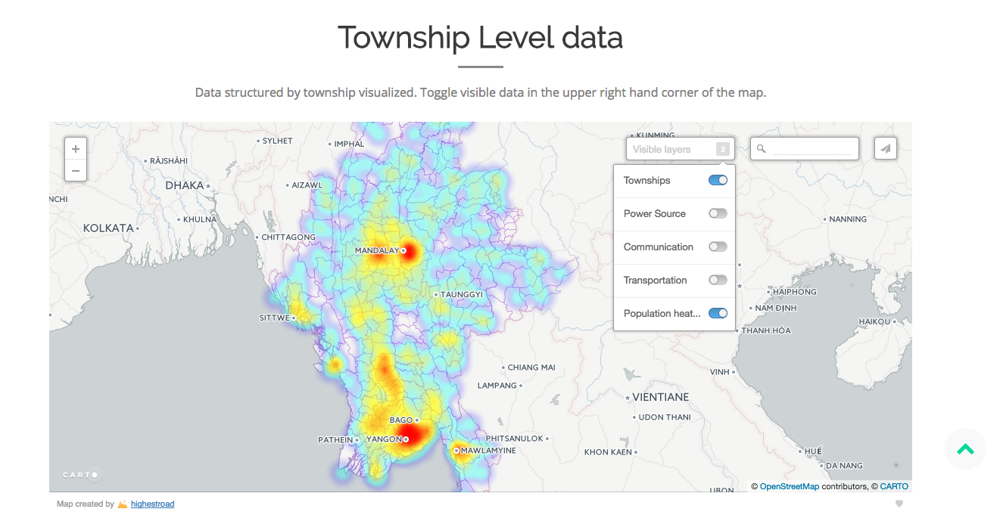
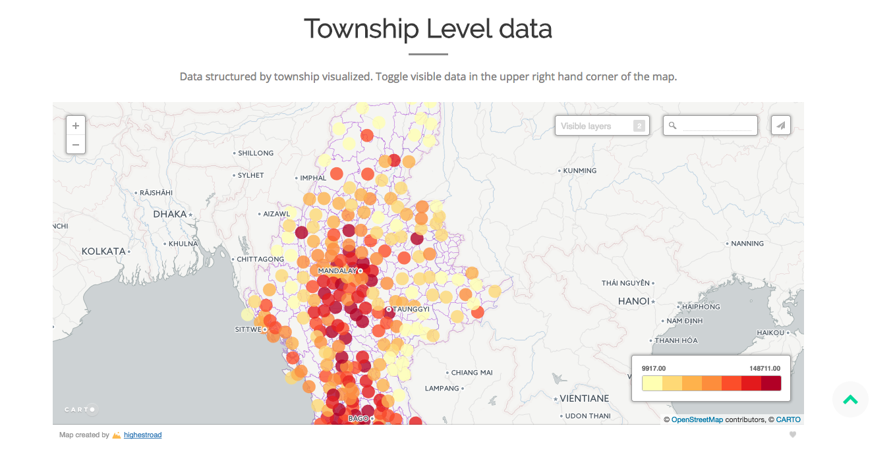
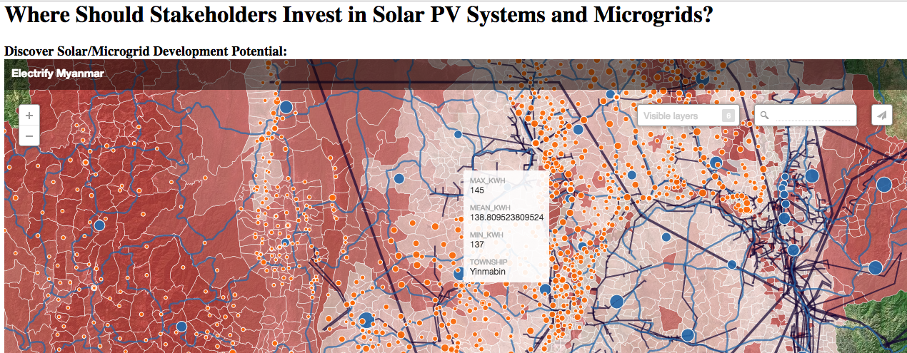

Work that we compiled during the Energy Challenge Hackathon

# Team Members:

[CAMERON KRUSE](https://www.linkedin.com/in/krusecameron/) - Young Explorer

VICTOR GARCIA - Data Scientist

[MEHMET TURANALP](https://www.linkedin.com/in/mehmet-emin-turanalp/) - Software Engineer

[LUKMAAN BAWAZER](https://www.linkedin.com/in/lukmaanbawazer/) - Data Scientist

[ANTHONY ABERCROMBIE](https://www.linkedin.com/in/anthony-abercrombie-67264895/) - Data Scientist

[ZACHARY THOMAS](https://www.linkedin.com/in/thomaszi/) - Data Scientist

[JASON CHIANG](https://www.linkedin.com/in/jachian22/) - Data Scientist

[BAOLIN LIU](https://www.linkedin.com/in/baolinliu/) - Data Scientist

# Prompt: 

Access to timely and reliable data about renewable development is a major barrier to the expansion of energy access

Implications of Data Constraints:

Lack of data and the ability to quickly analyze it developers from answering critical questions, such as:

• Who Needs It the Most?

– Household data to help identify those most in need Household 

• Who Can Pay? 

 – A lack of access to reliable data prevents developers and investors to accurately assess viability

• Where Should We Build? 

Qualitative, quantitative and geospatial data for helping determine renewable energy is currently incomplete

# Solution:

Our Motto is:

• See the data
• Be the data 
• Add to the data

# Workflow:

This is a adaptable solution for any data beyond Myanmar(Burma).  But this is the overall process:

After the data is uploaded, you can look it at a Township level.  This can easily be changed to zip codes.

You can also look at subgroups as well.  For example, if you choose power source from the data menu you can click on a dot (colored by total power sources surveyed in a township) , you can view a breakdown of power source.

You can also use a heatmap by selecting data you want to display:

You can also check the Microgrid data and the distances to a power line, the closer it is to a power line the bigger the circle

You can also look at energy potential.  Shaded areas have higher potential as opposed to the lighter areas.

# Links:

Landing Page to our main site:

[Cartesian Product](http://cameronwkruse.com/cartesianproduct/)

Solar Potential for the Country:

[Solar Potential](http://cameronwkruse.com/cartesianproduct/solarpotential)

Main Grid Plan Layout:

[Main Grid Plan](http://cameronwkruse.com/cartesianproduct/maingridplan)

